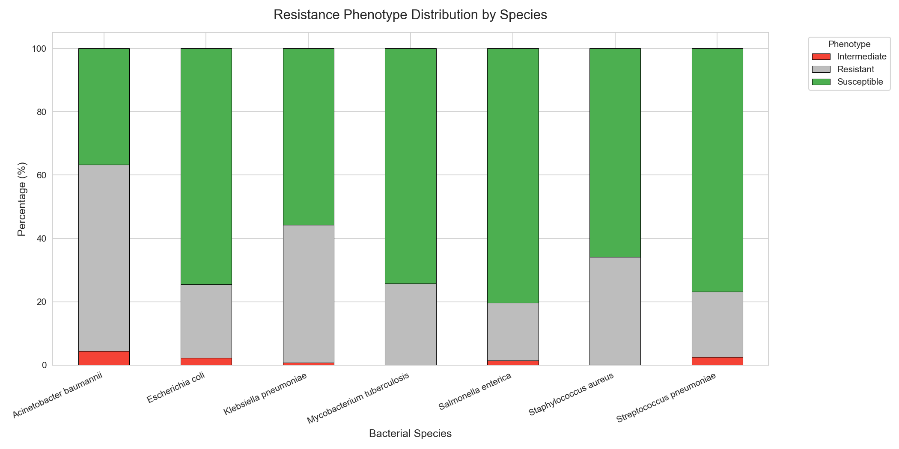
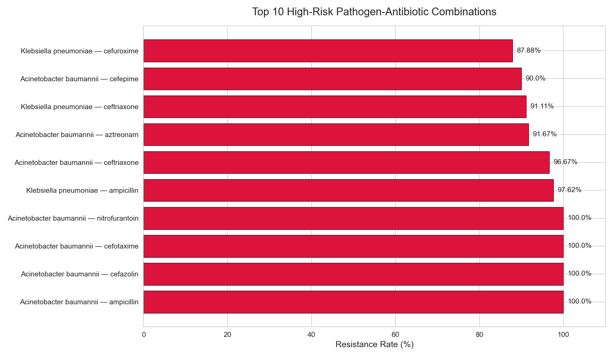
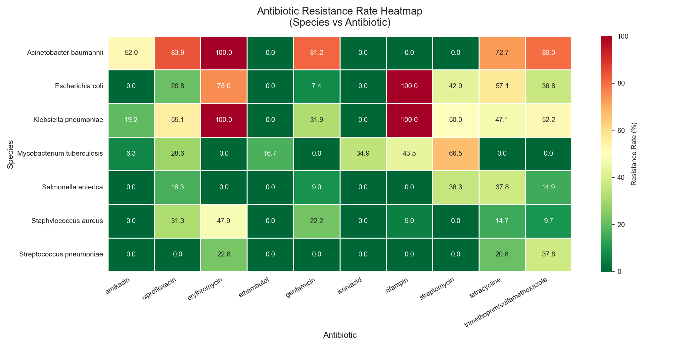
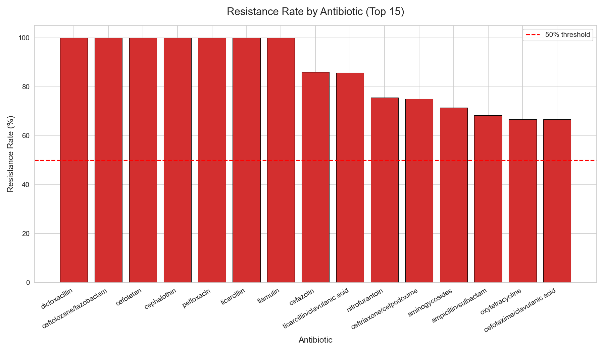
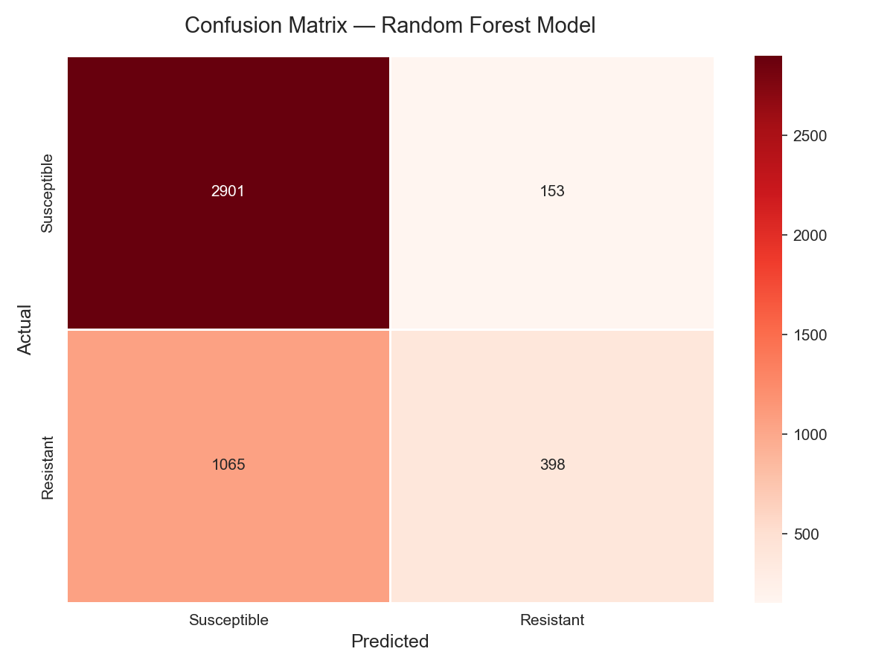
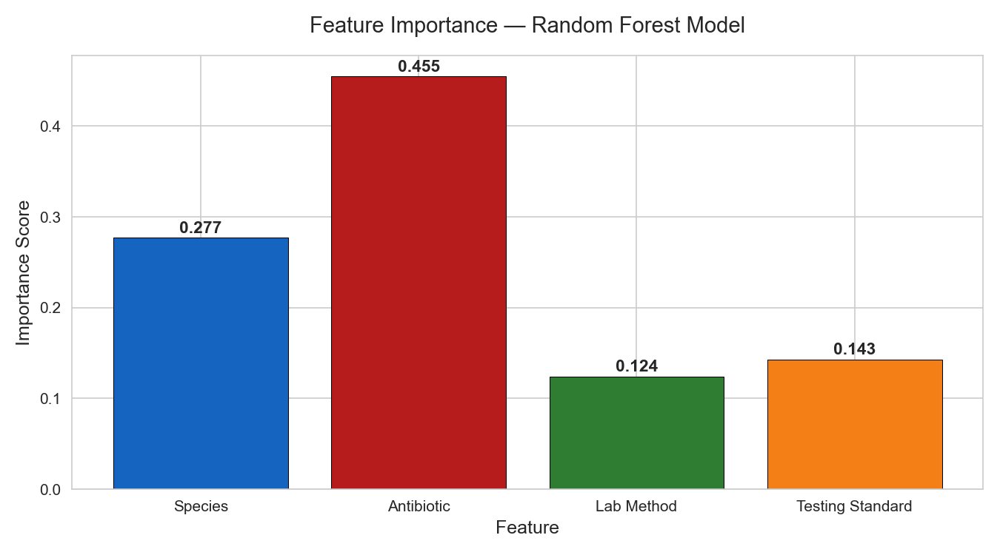

# Antibiotic Resistance Analysis & ML Prediction

## Overview
Analysis of 22,805 bacterial isolates from the PATRIC database to study 
antibiotic resistance patterns and predict resistance phenotypes using 
a Random Forest classification model.

## Species Studied
- Klebsiella pneumoniae
- Mycobacterium tuberculosis
- Streptococcus pneumoniae
- Staphylococcus aureus
- Salmonella enterica
- Escherichia coli
- Acinetobacter baumannii

## Tools & Libraries
- Python, Pandas, Scikit-learn, Matplotlib, Seaborn
- Data: PATRIC Database (patricbrc.org)

## Key Findings
- Acinetobacter baumannii shows highest resistance burden (~60%)
- Antibiotic identity is the strongest predictor of resistance (importance: 0.455)
- Random Forest model achieves 73.04% accuracy on held-out test set
- Klebsiella pneumoniae + Ampicillin predicted Resistant with 82.8% confidence
- Model predictions align with observed resistance rates validating biological relevance

## Model Performance
| Metric | Score |
|--------|-------|
| Accuracy | 73.04% |
| Dataset Size | 22,805 isolates |
| Train/Test Split | 80/20 |
| Algorithm | Random Forest (100 trees) |

## Plots







## How to Run
```bash
pip install pandas numpy matplotlib seaborn scikit-learn jupyter
jupyter notebook amr_analysis.ipynb
